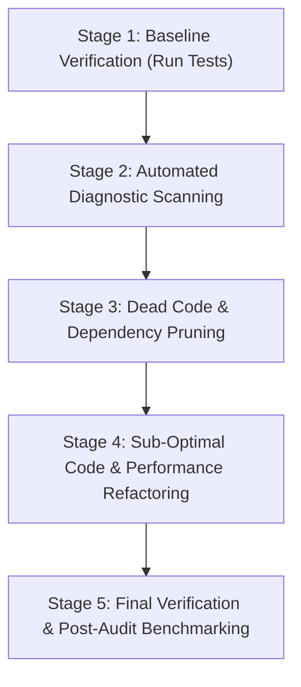

# Codebase Optimization Skill

This skill provides an end-to-end, structured runbook for auditing, reviewing, static analysis, dead code elimination, type safety hardening, and performance optimization across multi-language codebases using **Python** and **TypeScript**.

---

## 1. Optimization Objectives & Scope

When performing a codebase optimization pass, focus on five key objectives:

1. **Dead & Unused Code Elimination**: Removing unreachable functions, unused imports, dead variables, abandoned assets, and orphaned packages.
2. **Static Quality & Lint Enforcement**: Fixing anti-patterns, style violations, potential bugs, and code smells automatically where safe.
3. **Type Safety & Schema Hardening**: Guaranteeing static type correctness across Python type hints (`mypy`/`pyright`) and TypeScript schemas (`tsc`).
4. **Performance & Algorithmic Efficiency**: Replacing sub-optimal iterations, blocking I/O calls in event loops, un-memoized React re-renders, and inefficient data structures.
5. **Maintainability & Complexity Reduction**: Reducing cyclomatic complexity, breaking down monolith functions, and clarifying control flow.

---

## 2. Automated Tooling Matrix

Run the following static analysis tools to generate objective diagnostic reports before modifying code:

| Tool | Language | Target Domain | Command / Invocation |
| :--- | :--- | :--- | :--- |
| **Ruff** | Python | Fast linting, code style, unused imports | `ruff check .` / `ruff check --fix .` |
| **Vulture** | Python | Dead code detection (functions, classes, vars) | `vulture . --min-confidence 70` |
| **Mypy / Pyright** | Python | Static type checking & type safety | `mypy . --ignore-missing-imports` |
| **Coverage.py** | Python | Test coverage (detect untested/dead paths) | `pytest --cov=. --cov-report=term-missing` |
| **Radon / Xenon** | Python | Cyclomatic complexity & code maintainability | `radon cc . -a -s` |
| **Knip** | TypeScript | Unused files, dependencies, exports, types | `npx knip` |
| **TSC** | TypeScript | Type checking without emitting code | `npx tsc --noEmit` |
| **ESLint** | TypeScript / JS | Code quality, React hooks rules, security | `npx eslint . --fix` |
| **Depcheck** | TS / Node | Unused `package.json` dependencies | `npx depcheck` |

---

## 3. Step-by-Step Optimization Workflow

Follow this 5-stage iterative process to optimize without introducing regressions:



### Stage 1: Baseline Verification
> [!IMPORTANT]
> **Never optimize un-verified code.** Always run existing test suites first to verify that the codebase is currently green before making changes.

```bash
# Python test baseline
pytest

# TypeScript test & build baseline
npm run test
npm run build
```

### Stage 2: Automated Diagnostic Scanning

1. **Python Static Analysis**:
   ```bash
   # 1. Lint and auto-fix formatting/imports
   ruff check . --select F,E,W,I,UP,B,SIM

   # 2. Find dead code with Vulture
   vulture Raspberry/ --min-confidence 80

   # 3. Check Python types
   mypy Raspberry/ --ignore-missing-imports
   ```

2. **TypeScript / Frontend Static Analysis**:
   ```bash
   # Navigate to frontend directory
   cd Raspberry/frontend

   # 1. Run Knip to detect unused files, exports, and dependencies
   npx knip

   # 2. Type check
   npx tsc --noEmit

   # 3. Lint check
   npx eslint src/ --fix
   ```

### Stage 3: Dead Code & Dependency Pruning

- **Safely Remove Dead Code**:
  - Delete unused imports, unreachable `if/else` branches, commented-out dead code, and unused helper functions confirmed by `vulture` and `knip`.
  - Check dynamic invocations: Ensure functions accessed via `getattr()`, string reflection, or dynamic WebSocket message dispatchers are NOT falsely deleted.
- **Prune Unused Dependencies**:
  - Remove unused dependencies from `requirements.txt` or `package.json`.
  - Uninstall unused `node_modules` or Python packages to trim bundle/virtualenv footprint.

### Stage 4: Sub-Optimal Code & Performance Refactoring

Refer to detailed language-specific optimization checklists:
- [Python Performance & Clean Code Guidelines](./references/python-optimization.md)
- [TypeScript & Frontend Optimization Guidelines](./references/typescript-optimization.md)

#### Quick Checklist for Sub-Optimal Patterns:

##### Python Code Smells & Fixes:
- **AsyncIO Blocking**: Replace synchronous `time.sleep()`, synchronous `requests`, or blocking file/serial reads inside `async def` handlers with `await asyncio.sleep()`, `httpx`/`aiofiles`, or run blocking calls in `asyncio.to_thread()`.
- **Inefficient Lookups**: Convert list membership checks (`if item in my_list:`) to set or dictionary lookups (`O(1)` instead of `O(N)`).
- **Redundant Copies / Generator Expressions**: Use generator expressions (`sum(x for x in data)`) instead of allocating full temporary lists (`sum([x for x in data])`).
- **Global Locks & Contention**: Upgrade non-reentrant `threading.Lock` to `threading.RLock` or granular async locks to prevent deadlocks under high WebSocket traffic.

##### TypeScript / React Code Smells & Fixes:
- **Re-render Storms**: Wrap expensive calculations in `useMemo()` and callback functions passed as props in `useCallback()`.
- **Missing Effect Cleanup**: Ensure `useEffect()` hooks return a cleanup function to disconnect WebSockets, clear timers (`clearInterval`), and remove event listeners.
- **Un-bundled Imports**: Import specific icons or utility functions (e.g. `import { check } from 'lucide-react'`) rather than wildcard/monolithic imports (`import * as Icons`).
- **Stale Closures / Missing Dependencies**: Satisfy ESLint `react-hooks/exhaustive-deps` rules to prevent stale state references.

### Stage 5: Final Verification & Post-Audit Benchmarking

1. **Re-run Full Diagnostics**:
   - Confirm zero `ruff`, `vulture`, `knip`, `tsc`, or `eslint` warnings/errors remaining.
2. **Execute Full Test Suite**:
   - Run unit and integration tests to ensure logic integrity.
3. **Verify Build Output**:
   - Ensure `npm run build` completes successfully with reduced bundle sizes.

---

## 4. Verification Checklists & Commands

Run this execution checklist prior to declaring optimization complete:

```bash
# Python Quality Gate
ruff check .
vulture . --min-confidence 80
mypy . --ignore-missing-imports
pytest

# TypeScript / Frontend Quality Gate
cd Raspberry/frontend
npx tsc --noEmit
npx knip
npm run build
```

---

## 5. References & Specialized Guides

For deeper dive reference guides, consult:
- [Python Optimization Guide](./references/python-optimization.md)
- [TypeScript & React Optimization Guide](./references/typescript-optimization.md)
