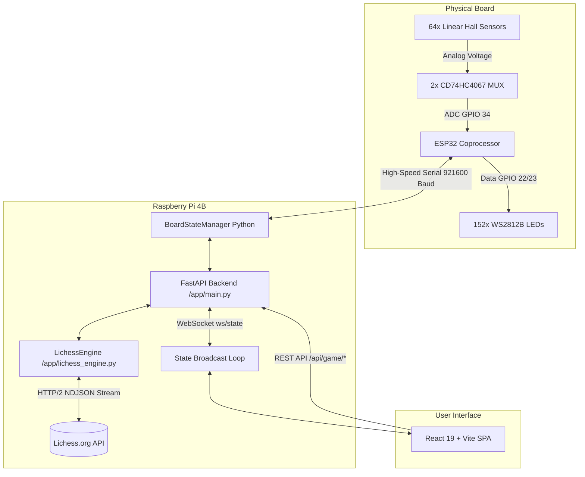

# ♟️ Smart Chess Board

[](https://fastapi.tiangolo.com)
[](https://react.dev/)
[](https://www.typescriptlang.org/)
[](https://tailwindcss.com/)
[](https://lichess.org/api)
[](https://www.espressif.com/)
[](https://www.raspberrypi.com/)
[](https://pytest.org)

An intelligent, physical-to-digital chess board system built on **Raspberry Pi** and an **ESP32** coprocessor. Features an 8x8 magnetic Hall effect sensor matrix, custom serpentine WS2812B LED indicators, real-time WebSocket state broadcasting, and native **Lichess Board API** integration with instant Stockfish AI challenges, online matchmaking, and a standalone **Virtual-Only** simulation mode.

---

## ✨ Features

- **🎯 Dual-Mode Play (Physical & Virtual)**
  - **Physical Board Mode**: Automatically scans magnetic chess piece placements using 64 linear Hall effect sensors and updates digital board state with hardware-level debouncing and automatic baseline drift compensation.
  - **Virtual-Only Simulation Mode**: Play full Lichess games directly in the web browser with click-to-move, legal destination dots, pawn promotion modals, and live clock timers without requiring the physical board connected.

- **🌐 Native Lichess Board API Integration**
  - **Smart Matchmaking**: Matches under 8 minutes (Bullet `1+0`, Blitz `3+0`, `3+2`, `5+0`, `5+3`) play instantly against **Stockfish AI (Levels 1–8)**. Matches 8 minutes and longer (`10+0 Rapid`, `15+10 Rapid`, `30+0 Classical`) connect to **live human matchmaking**.
  - **Real-Time NDJSON Streaming**: Zero-polling event stream synchronization for moves, sub-second chess clocks, check indicators, game termination, draw offers, and resignations.
  - **OAuth Account Sync**: Live profile badge showing rating statistics across Rapid, Blitz, and Bullet.

- **💡 Serpentine WS2812B LED Array (152 LEDs)**
  - 2 LEDs per square mapped in exact serpentine columns across two strips (Strip 1: files a–d, Strip 2: files e–h).
  - Multi-state animations: idle pulse, matchmaking sweep, opponent move flashes, active turn highlighting, and check alerts.
  - Thread-safe serial locking with ESP32 coprocessor to ensure zero visual jitter or framing desync.

- **📊 Comprehensive Web Dashboard**
  - **Play Tab**: Responsive 2D interactive chessboard, legal move indicator dots, pawn promotion modal dialogs, turn glow clock timers with low-time warnings, and game action controls (Seek, Cancel, Resign, Offer Draw).
  - **Debug & Calibration Tab**: 8x8 per-square raw ADC heatmaps, dynamic threshold adjustment sliders (up to ±3000), single-square LED testing, square disabling, and 2-second continuous baseline recalibration.

---

## 🏗️ System Architecture



---

## 🔌 Hardware & Wiring Specifications

### Components
- **Microcontrollers**: 1x Raspberry Pi 4B, 1x ESP32-WROOM-32 dev board.
- **Multiplexers**: 2x CD74HC4067 16-channel analog multiplexers.
- **Sensors**: 64x Linear Hall Effect Sensors (49E / AH49E series, ratiometric $V_{CC}/2$ output).
- **LEDs**: 2x WS2812B Addressable RGB LED strips (76 LEDs/strip, 152 total).
- **Magnets**: Neodymium disc magnets embedded in piece bases with consistent polarity.

### ESP32 Pin Assignments
| ESP32 GPIO | Peripheral Function | Direction |
| :--- | :--- | :--- |
| **GPIO 25, 26, 27, 14** | Column MUX Address (S0, S1, S2, S3 — Files a–h) | OUTPUT |
| **GPIO 16, 17, 18, 19** | Row MUX Address (S0, S1, S2, S3 — Ranks 1–8) | OUTPUT |
| **GPIO 34** | Common Analog Read (Col SIG line, 12-bit ADC) | INPUT |
| **GPIO 23** | WS2812B Strip 1 Data (Files a–d, 76 LEDs) | OUTPUT |
| **GPIO 22** | WS2812B Strip 2 Data (Files e–h, 76 LEDs) | OUTPUT |

### LED Serpentine Layout
- **Strip 1 (Files a–d, GPIO 23)**: 
  - File a: `a8` (LEDs 0, 1) $\rightarrow$ `a1` (LEDs 16, 17) [Down]
  - File b: `b1` (LEDs 18, 19) $\rightarrow$ `b8` (LEDs 34, 35) [Up]
  - File c: `c8` (LEDs 36, 37) $\rightarrow$ `c1` (LEDs 52, 53) [Down]
  - File d: `d1` (LEDs 54, 55) $\rightarrow$ `d8` (LEDs 70, 71) [Up]
- **Strip 2 (Files e–h, GPIO 22)**:
  - File h: `h8` (LEDs 76, 77) $\rightarrow$ `h1` (LEDs 93, 94) [Down]
  - File g: `g1` (LEDs 95, 96) $\rightarrow$ `g8` (LEDs 112, 113) [Up]
  - File f: `f8` (LEDs 114, 115) $\rightarrow$ `f1` (LEDs 131, 132) [Down]
  - File e: `e1` (LEDs 133, 134) $\rightarrow$ `e8` (LEDs 150, 151) [Up]

---

## 📁 Repository Structure

```
Smart-Chess-Board/
├── Raspberry/
│   ├── app/
│   │   ├── config.py              # Centralized hardware parameters & color definitions
│   │   ├── led_helpers.py         # DualPixelStrip driver & serpentine routing
│   │   ├── lichess_engine.py      # Async Lichess Board API & Stockfish AI engine
│   │   ├── board_state.py         # State manager, calibration & sensor polling
│   │   └── main.py                # FastAPI REST & WebSocket endpoints
│   ├── frontend/
│   │   ├── src/
│   │   │   ├── api.ts             # Typed backend client bindings
│   │   │   ├── hooks/useBoardState.ts  # WebSocket real-time state hook
│   │   │   └── App.tsx            # Main UI (Play, Debug, Controls, Board)
│   │   ├── package.json
│   │   └── vite.config.ts
│   ├── ESP32_firmware/
│   │   ├── analog_scanner/        # Arduino C++ firmware for ESP32
│   │   └── WIRING_GUIDE.txt       # Complete hardware schematic & pinout guide
│   ├── tests/                     # 52 pytest unit and integration tests
│   ├── board_hardware.py          # Hall matrix scanning & persistent settings
│   ├── hardware_test.py           # Standalone terminal hardware diagnostic tool
│   └── requirements.txt           # Python backend dependencies
├── .gitignore
├── PROJECT_STATE.md
└── README.md
```

---

## 🚀 Quick Start Guide

### 1. Prerequisites
- **Raspberry Pi**: Running Raspberry Pi OS with Python 3.11+ and Node.js 20+.
- **Lichess Account**: A Personal Access Token generated at [lichess.org/account/oauth/token](https://lichess.org/account/oauth/token) with the `board:play` scope.

### 2. Installation & Configuration

1. **Clone the repository**:
   ```bash
   git clone https://github.com/Niorb/Smart-Chess-Board.git
   cd Smart-Chess-Board
   ```

2. **Configure Environment Secrets**:
   Create a `.env` file inside `Raspberry/` (or copy from template):
   ```bash
   cp Raspberry/.env.example Raspberry/.env
   nano Raspberry/.env
   ```
   Add your Lichess token:
   ```env
   LICHESS_API_TOKEN=lip_your_lichess_token_here
   ```

3. **Install Python Dependencies**:
   ```bash
   python3 -m venv ~/venv/chess
   source ~/venv/chess/bin/activate
   pip install -r Raspberry/requirements.txt
   ```

4. **Build Frontend Production Bundle**:
   ```bash
   cd Raspberry/frontend
   npm install
   npm run build
   ```

### 3. Flash ESP32 Firmware
Open `Raspberry/ESP32_firmware/analog_scanner/analog_scanner.ino` in the Arduino IDE, install the `FastLED` or `Adafruit_NeoPixel` libraries, select your ESP32 board, and upload over USB.

### 4. Run Backend Server

#### Option A: Run Interactively (Manual)
```bash
cd ~/chess_git/Raspberry
source ~/venv/chess/bin/activate
uvicorn app.main:app --host 0.0.0.0 --port 8000
```

#### Option B: Automatic Startup on Pi Boot (systemd service)
Install and enable the `smart-chess` system service to automatically launch the server whenever the Raspberry Pi boots:
```bash
sudo cp ~/chess_git/Raspberry/smart-chess.service /etc/systemd/system/
sudo systemctl daemon-reload
sudo systemctl enable --now smart-chess
```

**Manage the Service:**
- View live service logs: `sudo journalctl -u smart-chess -f`
- Check service status: `sudo systemctl status smart-chess`
- Restart server: `sudo systemctl restart smart-chess`
- Stop service: `sudo systemctl stop smart-chess`

Open your browser at `http://<raspberry-pi-ip>:8000` to access the web app.

---

## 🧪 Testing & Verification

Run the full automated test suite (52 tests across hardware mocks, Lichess streaming, and API routes):
```bash
source ~/venv/chess/bin/activate
pytest Raspberry/tests/
```

Run standalone hardware diagnostics directly on the physical board:
```bash
python3 Raspberry/hardware_test.py
```

---

## 📡 API Reference

### REST Endpoints
| Method | Endpoint | Description |
| :--- | :--- | :--- |
| `GET` | `/api/lichess/account` | Retrieve authenticated Lichess username, ratings, and title |
| `POST` | `/api/game/seek` | Initiate Stockfish AI challenge or live human matchmaking |
| `POST` | `/api/game/move` | Submit move in algebraic UCI format (`e2e4`, `e7e8q`) |
| `POST` | `/api/game/resign` | Resign current active game |
| `POST` | `/api/game/draw` | Offer or accept draw |
| `POST` | `/api/game/mode` | Switch between physical hardware and virtual-only simulation |
| `GET` | `/api/board/health` | Subsystem diagnostics (Serial, GPIO, LEDs, Engine) |
| `POST` | `/api/board/calibrate` | Execute 2-second continuous sensor baseline recalibration |
| `POST` | `/api/board/settings` | Update thresholds, debounce window, and column mode |
| `POST` | `/api/board/clear_leds` | Force all physical WS2812B LEDs off |

### WebSocket Endpoint
- **`ws://<host>:8000/ws/state`**: Real-time state broadcast containing physical sensor matrix, analog ADC values, digital piece board, sub-second clocks, legal moves, check status, and opponent metadata.

---

## 📜 License
This project is licensed under the MIT License.
